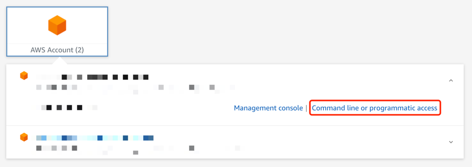
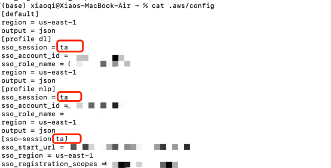

# Auto_CloudWatch

## Description
The code is for automatically adding alarms to the instances which has no alarms. It uses AWS SDK to get instances and add alarms.

## How to use
1. Install AWS CLI. 
   * Here is the offical article about how to install it: https://docs.aws.amazon.com/cli/latest/userguide/getting-started-install.html
   * Or you can install it using some package managers like: `$sudo apt install awscli / $brew install awscli`
2. To verify that the shell can find and run the aws command in your $PATH, use the following commands.
    * `aws --version`
3. Go into **Command line or programmatic access**, and configure AWS IAM Identity Center credentials in the local using: `aws configure sso`

4. `pip install boto3`
5. Replace your profile name in the code, and run the code
6. Every time you run the code after the certain period, like after a day, because the token has expired and refresh failed, you need to run `aws sso login --sso-session your_session_name` or `aws sso login --profile your-profile-name` to login first. 
7. I prefer changing `.aws/config` and putting two profiles in the same session. So I can log in by session instead of loging in two profiles one by one.
8. (Option) Use the exclude parameter, so alarms will not be added to those excluded instances. Use comma to seperate multiple excluded instances. For example:
   `python aws_cloudwatch.py --exclude excluded_instance_id_1,excluded_instance_id_2`
9. (Option) Set an ssh file to log in and run the code at the same time. Considering whether some instances are needed to be excluded, choose one of the following command:
   `sh auto.ssh`
   or
   `sh auto.ssh "--exclude excluded_instance_id_1,excluded_instance_id_2"`